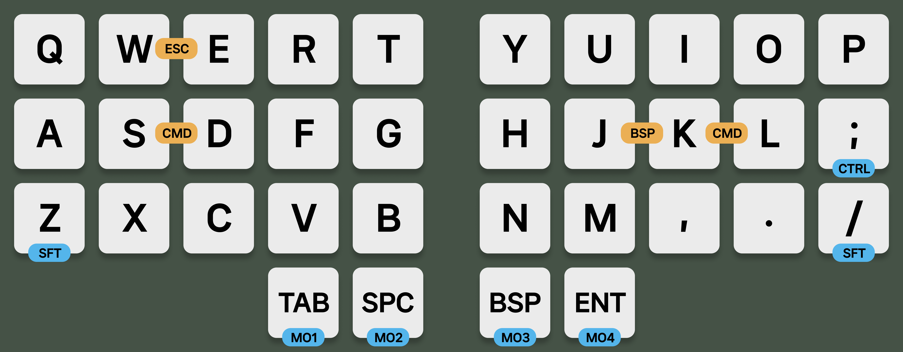
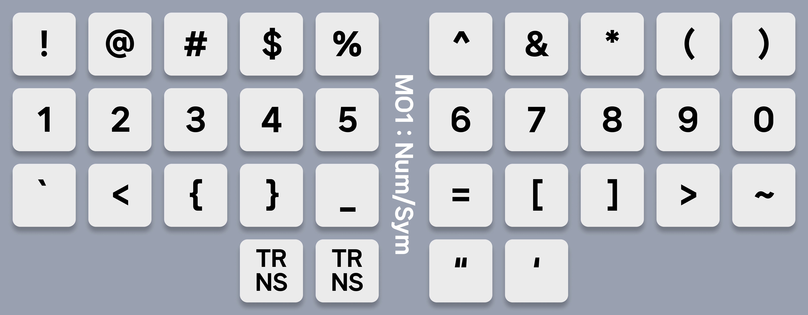
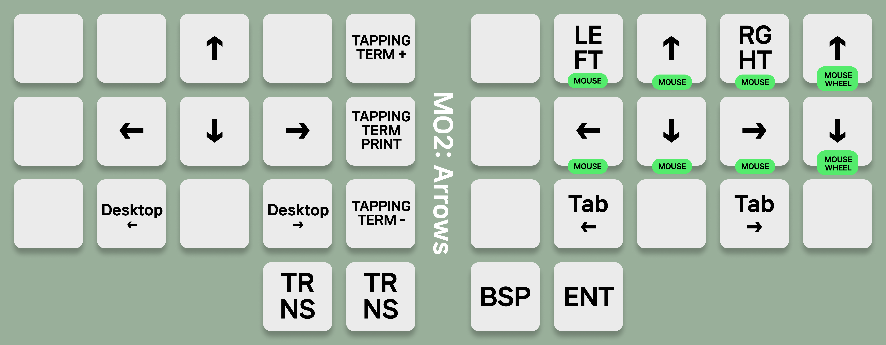
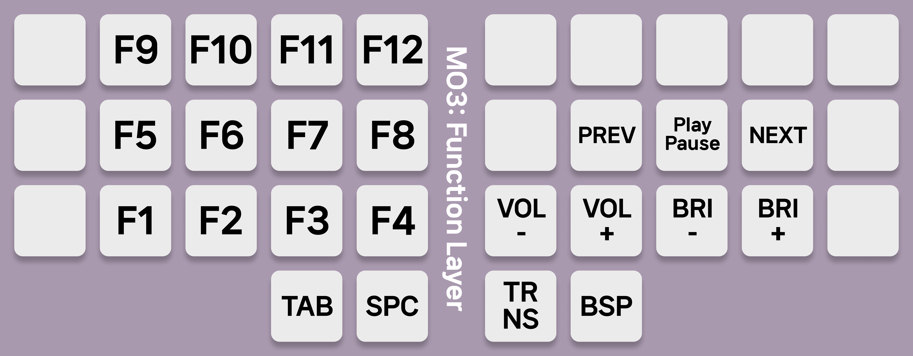
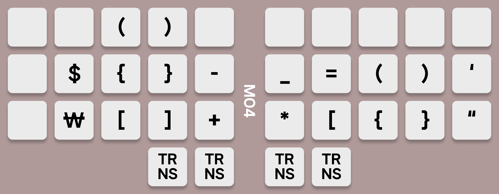

# moonwol, A Simple Keyboard Layout For 34-key Keyboards

I was trying hard to settle down in a keymap but every single keymaps had some uncomfortable things.

So, why shouldn't I create one?

> ...After millions of thousands of hundreds of years...

Boom. Here's **moonwol**.

## Design principle

1. Quick adaptive
2. No Home Row Mods
3. UNIX-Friendly

### 1. Quick Adaptive

Because I was using 60% keyboard(I was using [ErgoDash](https://github.com/omkbd/ergodash) and [Logi K380](https://www.logitech.com/en-us/products/keyboards/k380-multi-device.920-011135.html)), I tried my best to configure it familiarly so that I could become familiar with it quickly.

### 2. No Home Row Mods

TBH, I am not a good typier. 85 WPM in English, 500 in Korean. So I thought:

> I am enough slow to handle Home Row!

NO!!! FUCK NO!!!

Home Row mods made me like a turtle and gave me a horrible typing experience so I THROW THEM AWAY.

### 3. UNIX-Friendly

I know that Windows is market leader but I don't care because I use Mac as a daily driver, Linux as a backup machine.

## Layers Explained

Blue badge means tap-hold, yellow badge means combo keys.

### Layer 0: Base layer

I have to use QWERTY layout(Hangul keyboard is based on QWERTY Layout). Of course if you want to use an alternative layout like Colemak, Workman, or Dvorak, you can modify it freely.

Some guys put `shift` key in the index finger spot and they claim that index finger is stronger than pinky. I personally 100% agree with that, but my muscle memory was too strong to change my habits - that's why I put `shift` key in pinky position.

I had to put tap-hold keys(Of course I already tried to replace tap-hold keys to combo keys, but the result fucked me up) for convenience, but putting them in rarely used keys so that my typing experience won't get ruined.

### Layer 1: Arrows

Arrows, Arrows, Arrows!

No home rows, but personally think that tapping term key should exists for every keyboard which uses tap-hold keys. This key helps you to find the Sweet Spot easily. This keymap's default value is 130ms, you can try adding or removing 5ms per click.

Desktop left/right keys are exists for macOS. They work just like `control` + `left` or `right`.

Tab left/right keys for switching tabs in VSCode, Chrome, or other applications that supports switching tabs. `control` + `tab` for tab right, `control` + `shift` + `tab` for tab left.

### Layer 2: Numbers & Symbols

Numbers are on the home row because it is more easier to access than other position.

For quick adaptive from 60% key layout, symbols are following the 60% layout. After adaptive, num row may changed to num pad for convinence.

And should be aware that **quots are in the thumb finger** row.

### Layer 3: Function Keys

Fn keys are like a white elephant. It should exists, but rarely used. So I just merged it with media keys.

Volume keys, Brightness keys, Media keys and Fn keys are in a layer.

### Layer 4: Left symbols

This is blank layer, modify as you want. I just put some commonly used symbols.

## LICENSE

    A Simple Keyboard Layout For 34-key Keyboards
    Copyright (C) 2023  Mun Junsang

    This program is free software: you can redistribute it and/or modify
    it under the terms of the GNU General Public License as published by
    the Free Software Foundation, either version 3 of the License, or
    (at your option) any later version.

    This program is distributed in the hope that it will be useful,
    but WITHOUT ANY WARRANTY; without even the implied warranty of
    MERCHANTABILITY or FITNESS FOR A PARTICULAR PURPOSE.  See the
    GNU General Public License for more details.

    You should have received a copy of the GNU General Public License
    along with this program.  If not, see <https://www.gnu.org/licenses/>.
